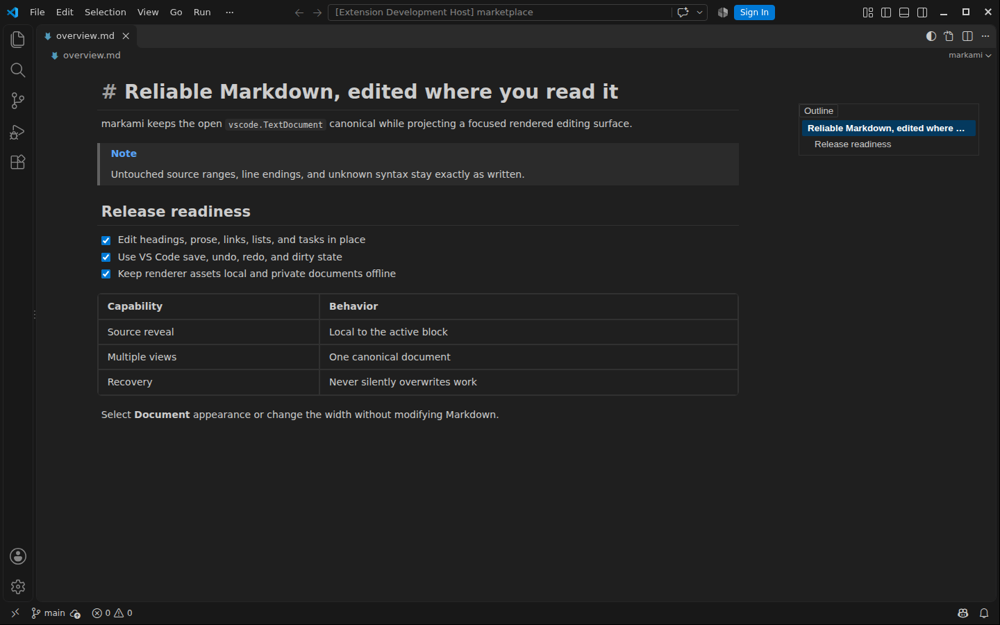
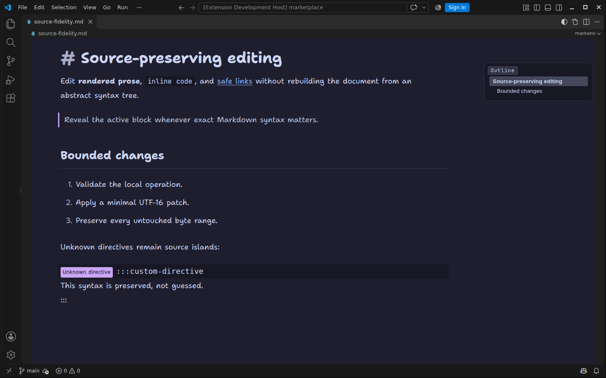
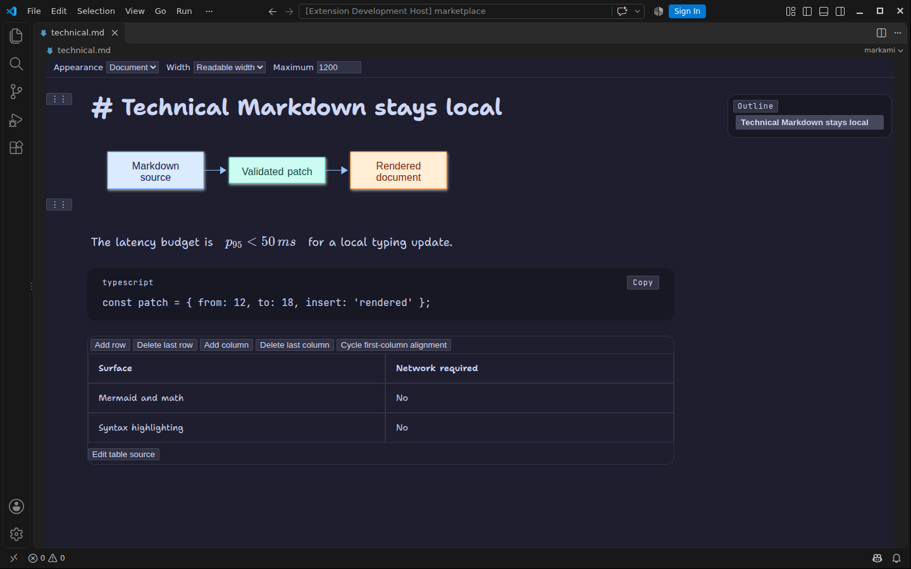

# markami

Edit Markdown where you read it.

markami is a visual Markdown editor for VS Code. Edit headings, lists, tasks, tables, and code directly
in the rendered document. Each change is applied to your source as a small, local edit, so untouched
parts of the file stay exactly as you wrote them and your Git diffs show only what you changed.

Rendered editing · Source-preserving · Mermaid and math · Works offline · No telemetry

<!-- marketplace-gallery:start -->
## See markami in action

### Edit in the rendered document

Read and edit Markdown in one rendered surface while VS Code keeps the source document canonical.

### Reveal source only when you need it

Reveal exact syntax for the active block without switching the whole document away from rendered editing.

### Keep technical content local

Mermaid, math, syntax highlighting, and table editing ship locally and continue to work offline.

<!-- marketplace-gallery:end -->

## Get started

Requires VS Code 1.102 or newer on desktop, with a local-filesystem workspace.

1. Install **markami** from the Extensions view, or run `code --install-extension shipsolid.markami`.
2. Open a `.md` or `.markdown` file and click the markami icon in the editor title bar, or run
   **markami: Open Rendered Editor**.
3. Edit in the rendered document and save as usual. Click the title-bar icon or run
   **markami: Open Source Editor** to return to the plain text editor at any time.

markami does not replace the native Markdown editor on its own. To open every Markdown file in markami,
use **Reopen Editor With… → Configure default editor for '*.md' → markami**; choose **Text Editor** in
the same menu to switch back.

## How it keeps your source intact

The open `vscode.TextDocument` remains canonical. markami applies validated local edits to the source
and never regenerates the document from a rendered tree.

## What ships

- Rendered editing for CommonMark and GitHub Flavored Markdown, including lists, tasks, tables,
  links, images, code, math, Mermaid, alerts, and safe HTML.
- Source reveal for the active block, selection, or explicit command; unsupported and ambiguous
  syntax remains editable in a source island.
- A slash-command insertion menu, selection formatting toolbar, and source-preserving block handles.
- Outline navigation and rendered-text/source-text find.
- A clean VS Code appearance (default) that follows your theme exactly, and an opt-in Document appearance with
  bundled Shantell Sans and JetBrains Mono and, in dark themes, the Catppuccin Mocha palette
  (`markami.document.palette`). Switch styles with the editor-title icon or **markami: Toggle Document Appearance**;
  width is `markami.document.width` or **markami: Set Document Width**.
- Per-file presentation preferences stored outside the Markdown source and synchronized across views.
- Conflict-safe external edit handling, bounded local recovery drafts, and native source fallback for
  documents larger than 4 MiB UTF-8.

See [syntax support](docs/syntax-support.md) for the detailed behavior and fallback matrix.

## Editing

- Type and select text directly in rendered blocks. `Ctrl/Cmd+B`, `Ctrl/Cmd+I`, and `Ctrl/Cmd+K`
  share the same bounded source-edit operations as the toolbar.
- Type `/` in an empty top-level paragraph for the insertion menu. The command
  **markami: Open Slash Commands** remains available when the automatic trigger is disabled.
- Focus a supported top-level block to use its handle. Copy or reveal its Markdown, or move it with
  **Move Block Up**, **Move Block Down**, or **Move Block To…**.
- Use **Toggle Source Reveal for Current Block** when exact syntax is more useful than projection.
- Use **Find in Document Text** for visible content or **Find in Markdown Source** for literal source.
- Table cells support `Tab`/`Shift+Tab`; `Tab` from the last cell can append a row as one undoable edit.

Opening, changing appearance, revealing source, navigating the outline, and finding text do not edit
the document. Accepted edits participate in VS Code save, autosave, undo, redo, dirty state, and
multi-view synchronization.

## Appearance and file preferences

Use the document toolbar or these commands:

- **markami: Set Document Appearance** — VS Code or Document typography.
- **markami: Set Document Width** — Auto, Readable, or Full.
- **markami: Reset File View Preferences** — clear overrides for the active file.
- **markami: Reset Workspace View Preferences** — clear remembered overrides for the workspace.

Preferences never enter Markdown or frontmatter. Disable per-file persistence with
`markami.viewPreferences.rememberPerFile`; session changes continue to work.

## Resources, privacy, and offline behavior

- Relative links and local images are resolved by the extension host and constrained to the workspace.
- Remote HTTPS images follow `markami.remoteImages`: `block`, `prompt` (default), or `allow`.
- Mermaid, math, code highlighting, fonts, and editor assets are packaged locally and work offline.
- Unsafe URLs, executable schemes, unsafe HTML, and filesystem escapes fail closed while source stays
  editable.
- markami has no telemetry, account, cloud sync, or document upload. Review the
  [privacy policy](PRIVACY.md) and [security policy](SECURITY.md).

## Fidelity boundaries

markami preserves untouched UTF-16 source ranges, line endings, BOM state, final-newline state, and
unknown syntax. An operation may normalize only its documented local construct (for example, a GFM
table changed structurally). If a safe mapping cannot be proven, strict mode leaves source visible
instead of guessing.

Files over 4 MiB UTF-8 open in the native source editor. Browser extension hosts are deferred; the
initial platform is desktop VS Code with local filesystem workspaces. MDX and custom directives are
preserved as source islands, not executed components.

markami is a Preview. IME composition and screen-reader behavior are covered by automated tests but have
not yet been verified on native assistive technology; please
[report problems](https://github.com/shipsolid/markami/issues).

## Recovery and troubleshooting

When an external edit overlaps unsynchronized local work, markami offers inspection, copy, reload,
or discard choices and never silently overwrites either version. Recovery drafts are local, bounded,
and separate from the Markdown file.

If rendering or editing behaves unexpectedly:

1. Run **markami: Open Source Editor** and confirm the canonical file is intact.
2. Run **markami: Show Diagnostics**. Diagnostics contain versions, counts, and feature state—not
   document content by default.
3. Disable the affected optional renderer (`markami.renderMermaid`, `markami.renderMath`, or
   `markami.renderSafeHtml`) and reopen the editor.
4. For remote images, inspect `markami.remoteImages` and workspace trust.

Report bugs at <https://github.com/shipsolid/markami/issues> with VS Code/OS versions, exact source or
a minimal redacted reproduction, the command or keystroke used, expected/actual behavior, whether the
native source changed, and reproduction steps from a clean profile. Never attach secrets or private
documents.

For source, support, licensing, and release history, see the
[repository](https://github.com/shipsolid/markami),
[issue tracker](https://github.com/shipsolid/markami/issues), [MIT license](LICENSE), and
[changelog](CHANGELOG.md).

## Contributing

To build markami, install a local VSIX, or run the verification gates, see
[docs/contributing.md](docs/contributing.md). Release evidence lives in [docs/delivery](docs/delivery/).

## License

markami is released under the [MIT License](LICENSE). Bundled dependency licenses are reproduced in
[THIRD_PARTY_NOTICES.txt](THIRD_PARTY_NOTICES.txt).
