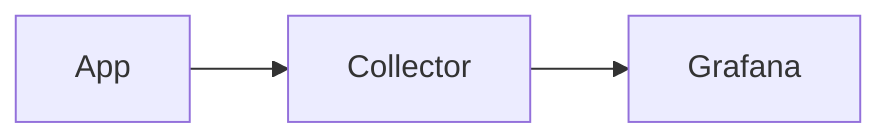

# markami — Product Specification

> **Tagline:** Edit Markdown where you read it.
>
> **Status:** Expanded end-to-end delivery specification, revision 2 — 2026-10-07
>
> **Implementation owner:** Codex, working task-by-task against this specification and `impl.md`
>
> **Primary surface:** Visual Studio Code / compatible desktop builds
>
> **Canonical data format:** Plain Markdown (`.md`, optionally `.markdown`)

---

## 1. Product Summary

markami is a VS Code extension that turns a Markdown file into a **single rendered, directly editable surface**. The user reads formatted Markdown and edits that same rendered document without maintaining a second preview pane and without repeatedly switching back to raw Markdown.

The defining property of markami is **source fidelity**. The Markdown file on disk remains the only source of truth. markami does not convert the document into a proprietary rich-text format and does not reserialize the full document after ordinary edits. Instead, the visual surface is a projection of the source document and edits are translated into the smallest safe source-text patches possible.

This differentiates markami from conventional WYSIWYG Markdown editors, which commonly parse Markdown into a rich document model and regenerate Markdown on save. That approach can normalize whitespace, delimiter choices, table formatting, list indentation, HTML, or unsupported extensions. markami must preserve untouched Markdown byte-for-byte whenever possible.

---

## 2. Problem Statement

VS Code's native Markdown workflow is primarily source-first:

1. edit raw Markdown;
2. open or focus a preview;
3. inspect the rendered result;
4. return to source to make another change.

For users who spend significant time inside Markdown specifications, architecture documents, READMEs, notes, runbooks, and technical documentation, this creates unnecessary context switching.

Existing WYSIWYG editors solve the context-switching problem but frequently introduce a different problem: they treat generated Markdown as an output format rather than as a carefully authored source file. Technical Markdown frequently contains constructs that must survive unchanged, including:

- YAML frontmatter;
- fenced code blocks and language identifiers;
- Mermaid diagrams;
- GitHub Flavored Markdown tables and task lists;
- raw HTML;
- custom directives or admonitions;
- footnotes;
- escaped characters;
- unusual list indentation;
- repository-specific conventions;
- embedded template syntax;
- unsupported or future Markdown extensions.

markami must provide a rendered editing experience without sacrificing the properties that make Markdown valuable to developers: plain text, Git diffs, portability, inspectability, and tooling compatibility.

---

## 3. Product Vision

### 3.1 Vision statement

> Markdown should feel like a document while remaining unquestionably a source file.

### 3.2 Core promise

When a user opens `architecture.md` in markami:

- they see a polished rendered document;
- the rendered content is directly editable;
- common formatting syntax is visually suppressed rather than permanently hidden from access;
- complex source constructs become safe interactive blocks or source islands;
- edits immediately update the real `.md` document;
- standard VS Code save, dirty-state, file watching, Git, source control, and external tooling continue to work;
- untouched source text is not reformatted merely because markami opened the file.

### 3.3 Product principles

1. **Markdown is canonical.** Never introduce a proprietary document format.
2. **Rendered is the default editing mode.** The user should not need preview/source shuffling for normal work.
3. **Lossless by default.** Opening, viewing, navigating, or closing a file must not change it.
4. **Minimal patches.** Editing one construct must not rewrite unrelated content.
5. **Source is always reachable.** Unsupported or ambiguous constructs degrade into editable source islands instead of being dropped or guessed.
6. **Developer-grade behavior.** Git diffs, external file changes, multiple editor views, keyboard workflows, large files, and technical syntax are first-class concerns.
7. **Local-first.** No document content leaves the machine unless the user explicitly invokes a future network feature.
8. **No AI dependency.** Core editing must be deterministic and fully functional offline.
9. **Accessible by keyboard.** Every editing operation must be possible without a mouse.
10. **Theme-native.** The editor should look like a VS Code surface, not an embedded unrelated web application.

---

## 4. Product Naming

### 4.1 Product name

**markami**

### 4.2 Tagline

**Edit Markdown where you read it.**

### 4.3 Brand contract

The user-selected product name is **markami**, styled in lowercase in the Marketplace, commands, README, and product UI. Use `Markami` only where an identifier convention requires PascalCase, such as `MarkamiProvider`. Keep the tagline **Edit Markdown where you read it.** No name-availability or trademark-clearance claim is implied.

### 4.4 Suggested identifiers

- Product: `markami`
- Repository: `markami`
- VS Code extension ID: `<publisher>.markami`; the publisher is an owner-supplied release input
- Custom editor `viewType`: `markami.editor`
- Settings namespace: `markami.*`
- Commands namespace: `markami.*`

A trademark/domain/package review should still be performed before public branding is finalized.

---

## 5. Target Users

### 5.1 Primary users

#### Developer / platform engineer

Writes and reviews:

- architecture documents;
- RFCs;
- implementation plans;
- READMEs;
- runbooks;
- ADRs;
- deployment instructions;
- operational documentation;
- Mermaid diagrams;
- code-heavy Markdown.

Needs visual readability but cannot tolerate source drift.

#### Technical writer inside a code repository

Uses Markdown because content is reviewed through Git. Wants a document-centric editor while preserving repository conventions.

#### Knowledge-work user who lives in VS Code

Maintains notes, project plans, or specifications next to code and does not want to open a second application such as Typora or Obsidian.

### 5.2 Secondary users

- open-source maintainers;
- documentation teams;
- SRE / DevOps engineers;
- product engineers writing design docs;
- researchers maintaining Markdown notes;
- users of AI coding agents that generate or modify Markdown files externally.

---

## 6. Jobs To Be Done

### JTBD-1 — Read and edit in one place

> When I open a Markdown document, I want the formatted document itself to be editable so that I do not have to switch between source and preview.

### JTBD-2 — Preserve repository-quality Markdown

> When I change one paragraph, I want only that paragraph's necessary source text to change so that my Git diff remains meaningful.

### JTBD-3 — Work safely with advanced Markdown

> When a document contains code, Mermaid, frontmatter, HTML, or custom syntax, I want markami to preserve what it does not understand rather than rewrite or delete it.

### JTBD-4 — Keep normal VS Code behavior

> When a file is changed by Git, an AI agent, another editor, or a build tool, I want markami to reflect the change without silently overwriting it.

### JTBD-5 — Stay in a keyboard flow

> When writing technical documents, I want familiar shortcuts, navigation, undo, save, find, links, and block insertion without reaching for raw source for routine work.

---

## 7. Scope

### 7.1 In scope for the first public-quality release

- `.md` and `.markdown` files;
- rendered editing in one editor tab;
- CommonMark-compatible prose;
- GitHub Flavored Markdown features;
- headings;
- paragraphs;
- bold, italic, strikethrough;
- inline code;
- links;
- images;
- unordered and ordered lists;
- nested lists;
- task lists;
- blockquotes;
- horizontal rules;
- fenced code blocks;
- GFM tables;
- YAML frontmatter;
- Mermaid fenced blocks;
- math blocks and inline math where enabled;
- GitHub-style alerts/admonitions where recognizable;
- raw HTML preservation with safe rendering policy;
- unknown syntax preservation;
- source reveal / source island editing;
- outline navigation;
- find in document;
- keyboard shortcuts;
- local images;
- relative links;
- external-change synchronization;
- multiple views of the same document;
- standard save / autosave / dirty state;
- mandatory slash command palette;
- floating selection formatting toolbar;
- block handles and source-preserving drag-to-reorder;
- VS Code and Document appearance modes;
- auto/readable/full document width controls;
- per-file view preferences stored outside Markdown;
- VS Code themes;
- accessibility semantics;
- VSIX packaging and Marketplace publishing.

### 7.2 Explicit non-goals for the initial release

- proprietary notes database;
- workspace graph / backlinks system;
- cloud synchronization;
- collaborative real-time editing;
- document publishing platform;
- PDF/DOCX/PowerPoint export;
- built-in AI rewriting;
- generalized MDX visual component editing;
- graphical Mermaid node editing;
- full Word/Notion feature parity;
- rich-text concepts that cannot be represented safely in Markdown;
- browser-based standalone editor;
- mobile app.

These may be separate products or later extensions, but they must not compromise the initial editor's fidelity model.

---

## 8. User Experience

## 8.1 Opening a Markdown file

markami registers an optional custom editor for Markdown.

Required behaviors:

- `Open With… → markami` must always be available.
- A setting may make markami the default editor for `*.md` / `*.markdown`.
- markami must not silently take over Markdown files immediately after installation.
- A command `markami: Open Rendered Editor` reopens the active Markdown file in markami.
- A command `markami: Open Source Editor` opens the same file in VS Code's native text editor as an escape hatch.

The primary workflow should never require the source editor, but the user must retain access to it.

## 8.2 Default appearance

The document appears like a technical document, not raw source:

- `#` heading markers are suppressed and headings are typographically styled;
- emphasis delimiters are suppressed while inactive;
- links show readable label text;
- task markers become interactive checkboxes;
- tables appear as tables;
- fenced code blocks appear as code blocks with language labels;
- Mermaid appears as a diagram when the block is not being edited;
- frontmatter appears as a compact metadata block;
- images render inline where safe and available;
- blockquotes and alerts render visually;
- Markdown remains selectable and editable as document content.

## 8.3 Editing model: Live Surface

markami has one primary mode: **Live Surface**.

Live Surface is not a separate read-only preview. It is the editor.

When the caret enters an element, markami may reveal only the syntax required to edit that element safely.

Examples:

### Bold

Stored source:

```md
The **collector** receives OTLP.
```

Inactive appearance:

> The **collector** receives OTLP.

When editing inside the bold span, the delimiters may remain hidden if the edit is unambiguous. A formatting command can toggle them without exposing source.

### Link

Stored source:

```md
See [deployment guide](./deploy.md).
```

Inactive appearance shows `deployment guide` as a link.

When the caret enters the link, markami presents an inline link affordance containing:

- label;
- destination;
- optional title;
- open-link action;
- remove-link action.

The raw source need not be revealed unless the user chooses **Edit as Source**.

### Code block

Stored source:

````md
```yaml
service:
  name: api
```
````

Rendered appearance is a syntax-highlighted code editor block with a `yaml` language badge. The content remains directly editable. Fence text is suppressed unless the user invokes source reveal.

### Mermaid

Stored source:

````md

````

Inactive state renders the diagram.

On click/focus:

- the block becomes an embedded Mermaid source editor;
- the diagram preview stays visible above or below the source when space permits;
- updates are debounced;
- the actual fenced source is patched directly.

No graphical Mermaid editing is required initially.

## 8.4 Source Reveal

Source Reveal is a contextual capability, not the default workflow.

Available mechanisms:

- `Ctrl/Cmd+Shift+M`: toggle source reveal for current block;
- context menu → **Edit Block as Markdown**;
- command palette → **markami: Reveal Source for Current Block**;
- unsupported syntax automatically becomes a source island.

Source Reveal must preserve the user's visual location and selection as closely as possible. The `activeBlock` policy reveals necessary syntax in the focused block; `selection` reveals syntax intersecting the selection and its confirmed enclosing construct; `manual` waits for explicit reveal for supported constructs. Every policy retains automatic source fallback for uncertain syntax and may expose delimiters to keep the caret usable.

## 8.5 Source Islands

A **Source Island** is a region of Markdown that markami cannot safely represent as a visual editable construct.

A Source Island:

- is displayed inline inside the rendered document;
- uses a monospaced source editor;
- is clearly labeled when syntax type is known;
- remains fully editable;
- writes directly to the original source range;
- never causes neighboring source to be normalized;
- can return to rendered representation if the resulting syntax becomes supported.

Examples:

- unfamiliar directives;
- custom template tokens;
- unsupported MDX;
- malformed Markdown;
- unsafe raw HTML;
- repository-specific extensions.

**Fallback rule:** preserve and expose source; never guess and rewrite.

---

## 8.6 Document appearance modes — required

Both appearance modes MUST ship. They change presentation only; the editing model and source fidelity contract stay identical.

| Mode value | UI label | Behavior |
|---|---|---|
| `vscode` | VS Code | The VS Code Markdown preview rendered in place: UI font, 14px at 1.6, ruled h1/h2, compact lists, theme-native controls and your exact theme colors; installation default |
| `document` | Document | Bundled reading fonts, generous paragraph spacing, stronger heading hierarchy, card-style technical blocks, optional Catppuccin Mocha palette in dark themes |

A small document toolbar provides an Appearance control; the command palette exposes the same choice. Switching modes preserves caret, selection, scroll anchor, open source islands, dirty state, and pending edits. It MUST produce no Markdown change or document undo entry. Font/color changes MUST not trigger Mermaid source changes or whole-document serialization.

Do not brand this mode as Notion or copy proprietary assets. A future Focus mode is outside 1.0; both required modes include the complete editing controls. High contrast overrides decorative styling in either mode. Reduced motion disables unnecessary transitions. Code and source islands always retain a monospace font regardless of body mode.

## 8.7 Document width controls — required

Width is independent of appearance. The document toolbar and `markami: Set Document Width` expose:

| Value | Behavior |
|---|---|
| `auto` | Responsive centered content column, up to maxContentWidth; oversized code/tables scroll within their block |
| `readable` | Centered prose column capped at `min(80ch, maxContentWidth)`; technical blocks scroll locally |
| `full` | Uses all available editor content width after gutters/padding; ignores maxContentWidth |

`markami.document.maxContentWidth` defaults to **1200 CSS pixels**, accepts integers **480–2400**, and applies to `auto` and `readable`. Values from invalid persisted state fall back to 1200. Narrow panes shrink to the available space rather than enforcing a 480-pixel layout. Reserve a block-handle gutter without covering text. At a 320-pixel pane width, controls wrap or use an overflow menu; the document shell must not require horizontal scrolling. A code/table region may scroll horizontally.

Changing width preserves the semantic scroll anchor and selection. Recalculate popover positions after resize/zoom/outline changes; do not treat a layout measurement as a source edit. Do not silently switch the entire document to full width because a diagram is wide; the user controls the preference.

## 8.8 Per-file view preferences — required

Remember appearance, width, maxContentWidth override, and syntaxReveal policy for each saved document when `markami.viewPreferences.rememberPerFile` is true. Also remember outline collapse state. These are presentation preferences, never YAML frontmatter fields or Markdown comments.

Effective preference precedence:

1. explicit per-file override;
2. VS Code resource-scoped configuration, including workspace-folder/workspace/user precedence;
3. extension defaults.

Store overrides in extension-owned workspace state keyed by the complete canonical document URI, including scheme/authority. Two files named `README.md` in different folders must not share preferences. Files opened without a workspace use extension-owned local state; untitled files use session-only preferences until saved. Do not add these URI keys to Settings Sync. Changing a default updates documents with no explicit override.

All views of one saved file converge on its stored appearance/width/reveal policy; transient caret, scroll, and individually revealed source block remain per-view. A changed preference is broadcast without overwriting another view's text or selection. Turning rememberPerFile off ignores stored overrides and uses session overrides until close; turning it on restores stored overrides. Existing data is deleted only by reset, eviction, or file deletion handling.

Provide reset for the current file and all markami preferences in the current workspace. Reset clears only markami view state and never edits files or unrelated settings. Migrate keys on an observed VS Code rename. A copied file starts with defaults. An external rename that cannot be confidently associated with the old URI starts with defaults. Prune deleted entries and bound retained records to 1000 per state scope using least-recently-used eviction. Unsupported preference schema versions degrade to defaults, leaving document content intact.

---

## 9. Editing Behavior by Syntax Type

| Syntax | Default visual state | Direct editing | Fidelity requirement |
|---|---|---:|---|
| Paragraph | rendered prose | yes | patch changed text only |
| H1–H6 | styled heading | yes | preserve heading style when practical |
| Bold | styled | yes | preserve `**` vs `__` where present |
| Italic | styled | yes | preserve `*` vs `_` where present |
| Strikethrough | styled | yes | preserve original delimiter |
| Inline code | code styling | yes | preserve delimiter length when possible |
| Bullet list | visual list | yes | preserve `-`, `*`, or `+` per item when possible |
| Ordered list | visual list | yes | preserve numbering unless command intentionally renumbers |
| Task list | checkbox | yes | clicking changes only task marker |
| Blockquote | styled quote | yes | preserve marker indentation |
| Link | rendered link | yes | preserve destination/title syntax |
| Image | rendered image | metadata edit | preserve relative path and title |
| Code fence | code editor block | yes | preserve backtick/tilde fence and length |
| Table | visual table | yes | minimally rewrite affected row/cell; no unrelated document changes |
| YAML frontmatter | metadata panel/source block | yes | preserve source; form editing is optional |
| Mermaid | diagram + source-on-focus | yes | patch fence content only |
| Math | rendered + source-on-focus | yes | preserve delimiters |
| Raw HTML | safe render or source island | source editing | never silently sanitize on disk |
| Unknown syntax | source island | yes | exact preservation outside user changes |

---

## 10. Fidelity Contract

The fidelity contract is the central product requirement.

### 10.1 No-touch guarantee

If a file is opened and closed without editing, the file must remain byte-identical.

### 10.2 Locality guarantee

A user edit should modify only the smallest source range necessary to express that change.

Example:

```diff
- The **old** value is 10.
+ The **new** value is 10.
```

markami must not also change:

- blank-line counts elsewhere;
- trailing spaces elsewhere;
- table alignment elsewhere;
- list bullets elsewhere;
- newline style elsewhere;
- code fences elsewhere;
- frontmatter formatting elsewhere.

### 10.3 Existing delimiter preservation

When an existing Markdown construct is edited without changing its semantic type, preserve its delimiter style when practical.

Examples:

- `__bold__` stays `__bold__`;
- `_italic_` stays `_italic_`;
- `~~~` fences stay tilde fences;
- `+ item` stays `+ item`;
- CRLF documents remain CRLF.

### 10.4 Normalization boundary

Normalization is permitted only when:

1. the user invokes a structural command that requires new syntax; or
2. preserving the exact local syntax is impossible or would produce invalid Markdown.

Any normalization must be confined to the smallest affected construct and covered by tests.

### 10.5 Unsupported syntax guarantee

Unsupported content must remain source-preserved. It may be rendered as a Source Island, but it must not be discarded, converted to HTML, or normalized automatically.

### 10.6 Invalid Markdown behavior

Malformed or incomplete Markdown while typing is expected. markami must remain editable and must not force the document into a parser-valid state.

---

## 11. Structural Editing Commands

The editor must support standard shortcuts and document-aware commands.

### 11.1 Inline formatting

- Bold: `Ctrl/Cmd+B`
- Italic: `Ctrl/Cmd+I`
- Inline code: configurable, default `Ctrl/Cmd+Shift+\`` where platform-safe
- Strikethrough: command palette and toolbar
- Create/edit link: `Ctrl/Cmd+K`

Behavior:

- with selection: wrap selection;
- without selection: toggle formatting at caret or insert empty construct;
- when already inside the construct: toggle off using minimal source patch.

### 11.2 Block commands

- paragraph;
- heading 1–6;
- bullet list;
- numbered list;
- task list;
- quote;
- fenced code;
- Mermaid block;
- table;
- horizontal rule;
- source island / raw Markdown block.

A compact slash command menu **MUST ship in 1.0**, enabled by default and keyboard navigable. Users may disable the trigger through `markami.slashCommands.enabled`; that setting does not make delivery optional. Section 11.5 defines the complete behavior.

### 11.3 List behavior

- Enter continues list item;
- Enter on empty item exits list;
- Tab / Shift+Tab indent/outdent where structurally valid;
- task checkbox click toggles `[ ]` / `[x]` using a minimal patch;
- changing task state must preserve uppercase `X` only if configured; default output is `[x]` for newly checked tasks.

### 11.4 Tables

Required table operations:

- edit cell text directly;
- Tab moves to next cell;
- Shift+Tab moves to previous cell;
- Tab on last cell can add a row;
- insert/delete row;
- insert/delete column;
- change alignment;
- source reveal.

Table editing may locally normalize the affected row or whole table if exact cell-range patching is unsafe, but markami must never normalize unrelated content. The UI must not support Markdown-inexpressible features such as merged cells unless represented explicitly as raw HTML.

---

### 11.5 Slash command palette — required, default on

Typing `/` at the beginning of an empty top-level paragraph opens a compact filtered insertion menu. While open, typed query characters filter entries; `/mer` finds Mermaid. Do not open automatically inside code, Mermaid source, frontmatter, links, inline math, URLs, non-empty prose, or unknown Source Islands. Nested-container insertion is deferred; ordinary `/` typing must continue to work there.

| Group | Required entries | Inserted/editing result |
|---|---|---|
| Basic | Text, Heading 1–6 | Current paragraph or ATX heading with caret in body |
| Lists | Bullet, Numbered, Task | Local marker, task unchecked initially |
| Basic | Quote, Divider | Blockquote prefix or horizontal rule |
| Technical | Code block | Fenced block with language choice; safe fence length |
| Technical | Table | Default 2-column table with header and one body row |
| Technical | Mermaid | Fenced Mermaid block with editable source and a local starter diagram |
| Technical | Math | Display math block when math is enabled |
| Assets | Image | Local-image picker or URL/alt-text form under existing resource policy |
| Advanced | Raw Markdown | Reveals current block source; does not invent a nonstandard fenced format |

Arrow keys navigate; Enter accepts; Escape closes; a pointer chooses an entry. Expose listbox/option semantics and announce the filtered count. Empty results show “No matching blocks.” Slash insertion removes only the active trigger and query, inserts the selected block, and is one logical undo step; undo restores the exact pre-insertion text, including the query if it was already committed as typing.

Escape or moving away leaves typed text unchanged. Disabling the setting prevents auto-open but `markami: Open Slash Commands` remains available at a supported insertion location. Commands that need a dialog apply nothing until confirmation. Cancelled image/language dialogs preserve typed text. A pending menu captures the source version and range; external edits invalidate or safely remap it before acceptance. No action may target a stale offset.

Menu visibility and contents reflect feature configuration. Math disabled means no math insertion entry. Mermaid rendering disabled still permits Mermaid source insertion. Existing slash strings anywhere in a file remain byte-identical when merely viewing it.

### 11.6 Floating selection toolbar — required, default on

Show a compact toolbar for a non-empty eligible text selection, positioned above it when space permits and below otherwise. It offers bold, italic, strikethrough, inline code, create/edit link, heading/paragraph conversion, and clear inline formatting. Commands share implementations with shortcuts, context menus, and the command palette.

The toolbar never appears merely because a cursor is present. Do not show it during IME composition, drag operations, or for selections inside code/frontmatter/Mermaid source/unknown islands. Mixed selections spanning unsupported blocks or multiple disjoint ranges disable unsafe operations with an accessible reason. This UI limitation must not disable ordinary typing or the native source escape hatch.

Clicking a button preserves the captured selection until the operation completes. Keyboard access uses `markami: Show Selection Toolbar`, roving focus, Enter/Space activation, and Escape to return focus to the original selection. The menu must not obscure selected text, trap focus, or unexpectedly scroll the document. Active formatting is communicated through pressed/mixed states and screen-reader labels.

Clear formatting removes only recognized inline emphasis, strike, code, and link wrappers within the selected range. Keep the text, reference definitions, and unrelated wrappers outside the range. If removing a delimiter would break Markdown or leak formatting beyond the selection, disable the operation and explain why. Heading conversion applies only to a single paragraph/heading eligible for conversion; nested blocks or multiple paragraphs use explicit block commands instead. Preserve Setext form where valid for H1/H2; converting to other heading levels may change only that heading's syntax.

Opening, dismissing, repositioning, or toggling toolbar visibility changes no source. Each accepted command patches confirmed source ranges, preserves delimiter conventions where feasible, and is one undo step. A selection captured before an external edit must be mapped or invalidated rather than applied to a different word.

### 11.7 Block handles and drag-to-reorder — required

A handle appears in the left gutter for the hovered or focused supported top-level block, including paragraph, heading, entire list, quote, code, table, image block, Mermaid, math, and confidently bounded Source Islands. Keyboard focus reveals the same affordance. The handle offers source reveal, copy as Markdown, and move commands.

The initial move unit is **one complete top-level block**, not an arbitrary DOM region. A list moves with all items and descendants; a quote moves as one container. Dragging a heading moves only that heading, not its section. Indent/outdent and nested item reparenting are separate list commands; automatic hierarchy changes while dragging are outside 1.0.

Frontmatter is pinned at the beginning. Do not move BOM metadata, frontmatter fences, or a malformed region whose boundaries are uncertain. Disable unsafe targets rather than guessing. A source island can move only if its complete top-level source range is unambiguous.

Interaction contract:

- drag shows a clear insertion line at legal sibling boundaries;
- auto-scroll near the viewport edge;
- reject drops inside the moved block, inside a different container, or before pinned frontmatter;
- Escape cancels without a write;
- dropping at the same location is a no-op;
- use Move Block Up/Down and Move Block To… as complete keyboard alternatives;
- announce source block, destination, success/cancellation, and unavailable targets to assistive technology.

The operation moves exact source text and does not regenerate Markdown from an AST. Preserve bytes within the block: bullet characters, indentation, comments, fences, table spacing, and unknown syntax. Preserve unrelated blocks and their order. Separator edits are allowed only at the removal/insertion seams when required to keep blocks syntactically separate; preserve existing blank lines elsewhere. A trailing block without a newline must not be joined to its new neighbor accidentally.

Determine separator ownership and legal targets before committing, then validate that moving the block has not merged constructs or reinterpreted neighboring content. If preserving the moved core plus bounded seam changes cannot produce a safe result, reject the move. Display any required seam adjustment in the move affordance; it is included in the one undoable operation.

Dragging captures source version, block identity/range, and allowed targets. Any document change during drag cancels the operation with “Document changed; start the move again.” Movement of a block MUST atomically update all views and keep the caret anchored to the moved block. Failure to apply a patch leaves the canonical file unchanged and preserves local work for recovery.

---

## 12. Frontmatter

### 12.1 Detection

Recognize YAML frontmatter only when it appears as a valid top-of-document fenced block.

### 12.2 Default UI

Show a compact collapsible metadata surface with a **Source** action.

Initial release requirements:

- preserve the entire original block unless edited;
- source editing is always available;
- common scalar values may optionally be edited through simple fields;
- complex YAML values fall back to source editing;
- comments, anchors, ordering, quoting style, and formatting must not be destroyed by opening the metadata UI.

Because YAML round-tripping can be lossy, full object parse → serialize must not be the default write path.

---

## 13. Code Blocks

Code blocks must behave more like embedded editors than static previews.

Required capabilities:

- monospace editor;
- syntax highlighting based on fence info string when available;
- horizontal scrolling for non-wrapped code when configured;
- copy button;
- language label;
- preserve fence character and minimum fence length;
- preserve metadata after the language identifier;
- keep indentation intact;
- do not run code.

Large code blocks should be virtualized or rendered efficiently.

---

## 14. Mermaid

### 14.1 Rendering

Recognize fenced blocks whose language is `mermaid` case-insensitively.

Inactive block:

- render SVG diagram locally;
- show an error panel without destroying source if rendering fails.

Active block:

- expose Mermaid source editor;
- keep preview visible where practical;
- debounce rendering;
- never send diagram source to a remote service.

### 14.2 Security

Mermaid must run under a restrictive configuration. Generated content must not gain arbitrary script execution or unsafe link behavior.

---

## 15. Math

Math is optional through a setting but supported by the architecture.

Recognizable forms may include:

- `$...$` inline math;
- `$$...$$` display math.

Behavior:

- rendered when inactive;
- source editable on focus;
- parser ambiguity with dollar signs must favor source safety over aggressive rendering.

---

## 16. Raw HTML and Unsafe Content

Raw HTML is valid in many Markdown dialects but is also a security boundary.

Rules:

1. Markdown source is never modified merely to sanitize it.
2. `<script>`, event handlers, embedded forms, unsafe iframes, and executable content are never executed.
3. Safe HTML may be rendered through an allowlist/sanitizer.
4. Unsafe or ambiguous HTML becomes a Source Island.
5. `javascript:` and `command:` links are blocked from direct execution.
6. Links that leave VS Code are opened through VS Code's trusted external-opening mechanism.

---

## 17. Images and Assets

### 17.1 Local images

Support:

- relative paths;
- workspace-relative paths where resolvable;
- percent-encoded file names;
- common raster formats supported by the VS Code webview;
- SVG subject to the webview/security policy.

The extension host resolves local resources and exposes them to the webview through VS Code-safe webview URIs.

### 17.2 Remote images

Remote images can leak network metadata. Default policy:

`markami.remoteImages = "prompt"`

Values:

- `block`;
- `prompt`;
- `allow`.

Blocked images display a placeholder and preserve the original Markdown unchanged.

### 17.3 Paste image

Not required for the first minimal build. For public-quality release, optional workflow:

- paste image from clipboard;
- save under configurable workspace-relative asset folder;
- insert relative Markdown image syntax;
- never base64-embed by default.

---

## 18. Links

Required behaviors:

- normal click places caret/selects link in edit context;
- `Ctrl/Cmd+Click` opens link;
- relative `.md` links open inside VS Code;
- fragment links navigate to heading when possible;
- external HTTP(S) links open through VS Code;
- unsafe schemes are blocked;
- link destination is editable inline without forcing raw source mode.

---

## 19. Find, Navigation, and Outline

### 19.1 Find

`Ctrl/Cmd+F` searches visible document text and source-island text.

Requirements:

- highlight matches;
- next/previous;
- match count;
- case sensitivity;
- whole word;
- regex may be later if it complicates the first release.

### 19.2 Outline

Optional right-side or lightweight floating outline generated from headings.

Requirements:

- click heading to navigate;
- active heading tracking;
- collapsible outline;
- setting to disable;
- must not materially reduce writing width on small editor panes.

---

## 20. External Changes and Concurrency

Markdown files may change from:

- another VS Code editor;
- Git checkout/rebase;
- AI coding agents;
- formatters;
- scripts;
- filesystem synchronization;
- another markami view.

Rules:

1. VS Code's `TextDocument` is canonical.
2. Every edit request carries the document version it was based on.
3. The extension serializes edits per document.
4. If an edit is based on a stale version, it is not blindly applied.
5. The webview receives current document changes and rebases or requests a full resync.
6. markami must never silently overwrite a newer external change.
7. Multiple visual editor views of the same file must converge on the same source document.
8. IME/composition edits receive special handling so a temporary composition state is not corrupted by an external refresh.

If safe automatic reconciliation is impossible, show a non-destructive conflict banner with options to reload the latest document or open the native diff/source view.

---

## 21. Save, Autosave, Undo, and Redo

### 21.1 Save

- the underlying `TextDocument` participates in VS Code dirty state;
- `Ctrl/Cmd+S` saves the actual Markdown file;
- VS Code Auto Save remains authoritative;
- opening markami must not create an independent shadow file.

### 21.2 Undo/redo

User expectations:

- `Ctrl/Cmd+Z` undoes the previous logical editing action;
- `Ctrl/Cmd+Shift+Z` or platform equivalent redoes;
- toolbar/context actions are undoable;
- external VS Code undo/redo must synchronize into the rendered surface.

Logical actions such as “toggle bold”, “insert row”, “insert slash block”, “move block”, or “toggle task checkbox” MUST be one undo step. Appearance and width changes do not enter document undo history.

---

## 22. Commands

Minimum command set:

- `markami: Open Rendered Editor`
- `markami: Open Source Editor`
- `markami: Toggle Source Reveal for Current Block`
- `markami: Reveal Current Block as Markdown`
- `markami: Toggle Bold`
- `markami: Toggle Italic`
- `markami: Toggle Inline Code`
- `markami: Create or Edit Link`
- `markami: Insert Heading`
- `markami: Insert Bullet List`
- `markami: Insert Numbered List`
- `markami: Insert Task List`
- `markami: Insert Code Block`
- `markami: Insert Mermaid Block`
- `markami: Insert Table`
- `markami: Refresh Rendered Blocks`
- `markami: Copy Current Block as Markdown`
- `markami: Show Selection Toolbar`
- `markami: Toggle Strikethrough`
- `markami: Clear Inline Formatting`
- `markami: Open Slash Commands`
- `markami: Move Block Up`
- `markami: Move Block Down`
- `markami: Move Block To…`
- `markami: Set Document Appearance`
- `markami: Set Document Width`
- `markami: Reset File View Preferences`
- `markami: Reset Workspace View Preferences`
- `markami: Insert Image`
- `markami: Insert Math Block`
- `markami: Insert Divider`
- `markami: Show Diagnostics`

---

## 23. Settings

The following settings are the initial configuration contract; new controls are defined below:

```jsonc
{
  "markami.openAsDefault": false,
  "markami.syntaxReveal": "activeBlock",
  "markami.remoteImages": "prompt",
  "markami.renderMermaid": true,
  "markami.renderMath": true,
  "markami.renderSafeHtml": true,
  "markami.codeBlock.wrap": true,
  "markami.outline.enabled": true,
  "markami.slashCommands.enabled": true,
  "markami.selectionToolbar.enabled": true,
  "markami.blockHandles.enabled": true,
  "markami.appearance.mode": "vscode",
  "markami.document.width": "auto",
  "markami.document.maxContentWidth": 1200,
  "markami.document.palette": "catppuccin-mocha",
  "markami.viewPreferences.rememberPerFile": true,
  "markami.sourceIslands.showLabel": true,
  "markami.theme.useEditorFont": false,
  "markami.assets.pasteDirectory": "assets/${documentBasename}",
  "markami.debug.showSourceRanges": false
}
```

Strict fidelity is an invariant: unsupported transformations fall back to source rather than normalizing uncertain syntax.

---

### 23.1 New settings and validation

| Setting | Type/default | Scope and behavior |
|---|---|---|
| `markami.slashCommands.enabled` | boolean / true | Resource; disables typed trigger only |
| `markami.selectionToolbar.enabled` | boolean / true | Resource; shortcuts and explicit toolbar command still work |
| `markami.blockHandles.enabled` | boolean / true | Resource; hides gutter affordance, retains keyboard move commands |
| `markami.appearance.mode` | `vscode` or `document` / `vscode` | Resource default; file override permitted |
| `markami.document.width` | `auto`, `readable`, `full` / `auto` | Resource default; file override permitted |
| `markami.document.maxContentWidth` | integer 480–2400 / 1200 | CSS pixels; ignored by `full` |
| `markami.document.palette` | `catppuccin-mocha` or `vscode` / `catppuccin-mocha` | Document appearance only, and only in dark themes; light and high-contrast themes always follow VS Code |
| `markami.viewPreferences.rememberPerFile` | boolean / true | Window; controls persistence, never edits Markdown |
| `markami.syntaxReveal` | `activeBlock`, `selection`, `manual` / `activeBlock` | Resource; file policy override permitted |

Validate configuration in the host and webview. Invalid enums, unknown preference fields, and non-finite widths do not crash the editor. Settings UI explains scope, defaults, and reset behavior. View preferences cannot override security or remote-image policy. No document can enable network access by adding frontmatter metadata.

### 23.2 Default editor association

Use VS Code's Reopen With / Configure Default Editor flow. Installing markami MUST keep custom editor priority `option`. The `openAsDefault` preference is an explicit opt-in intent; it is not permission to replace the entire `workbench.editorAssociations` map. Codex must prefer VS Code's built-in default-editor UI, or merge only the selected Markdown patterns after an explicit user action. No startup write to editor associations. Explain how to return to the native editor in onboarding and README.

---

## 24. Accessibility

Required:

- semantic document roles where practical;
- all controls keyboard reachable;
- visible focus indicators;
- screen-reader labels for formatting controls and task checkboxes;
- table navigation semantics;
- high-contrast theme compatibility;
- no meaning conveyed by color alone;
- reduced-motion preference respected;
- zoom works with VS Code zoom;
- selectable text remains selectable;
- source islands expose code-editor semantics.

---

## 25. Theme Integration

Use VS Code theme CSS variables for:

- foreground/background;
- borders;
- link colors;
- code backgrounds;
- focus outlines;
- error/warning colors;
- selections;
- editor font family and size where configured.

Avoid hard-coded theme palettes except neutral fallback values.

---

## 26. Security and Privacy

### 26.1 Privacy defaults

- no account;
- no document upload;
- no server dependency;
- no telemetry in the first public release unless explicitly introduced later;
- no remote image fetch without policy approval;
- no AI calls;
- no hidden indexing outside the open document/workspace requirements.

### 26.2 Webview security

- strict Content Security Policy;
- scripts loaded only from extension-controlled resources with nonces/hashes;
- restricted `localResourceRoots`;
- all webview ↔ extension messages schema-validated;
- no arbitrary command execution;
- external URLs validated in the extension host;
- sanitize rendered raw HTML;
- Mermaid configured defensively;
- never trust Markdown content merely because it comes from the local workspace.

---

## 27. Performance Requirements

Reference targets for a normal developer laptop:

### 27.1 Opening

- 10 KB document: first interactive surface ≤ 200 ms target;
- 100 KB document: ≤ 500 ms target;
- 1 MB document: ≤ 1.5 s target, using viewport-oriented rendering where needed.

These are engineering targets rather than hard Marketplace guarantees.

### 27.2 Typing

- normal prose keystroke-to-paint p95 < 50 ms;
- no full-document rich serialization per keystroke;
- expensive rendering such as Mermaid must be debounced and isolated;
- offscreen heavyweight widgets should be lazily rendered where possible.

### 27.3 Memory

- avoid keeping duplicate heavyweight ASTs longer than required;
- clear renderer caches when documents/views close;
- no unbounded diagram/image cache.

---

## 28. Reliability Requirements

markami must prefer degraded editing over data loss.

Order of priorities:

1. preserve source;
2. keep editing available;
3. keep source and rendered surface synchronized;
4. maintain visual fidelity;
5. provide enhanced interactive controls.

If an advanced renderer fails, the source content must remain editable.

---

## 29. Diagnostics

A `markami: Show Diagnostics` command should expose non-sensitive runtime information:

- extension version;
- VS Code version;
- active parser features;
- document size;
- newline mode;
- render timing summary;
- count of source islands;
- count of failed widgets;
- last synchronization status;
- whether remote resources are blocked;
- sanitized error messages.

Document body content must not be included by default in diagnostic exports.

---

## 30. Compatibility

### Initial target

- current stable VS Code desktop on Windows, macOS, and Linux;
- Electron/webview runtime supplied by VS Code;
- UTF-8 Markdown files, while respecting the encoding exposed by VS Code.

### Deferred

- `vscode.dev` / browser extension host;
- Codespaces browser-only constraints;
- remote filesystem edge cases beyond normal VS Code `TextDocument` support.

The codebase should avoid unnecessary desktop-only assumptions, but desktop correctness takes priority initially.

---

## 31. Extension Interoperability

markami should coexist with:

- Markdown linting extensions;
- Git/source control;
- spellcheckers where diagnostics can be surfaced;
- formatters;
- AI coding agents;
- file watchers;
- VS Code Markdown preview.

markami must not automatically invoke a formatter on save. Formatting remains the user's separate repository policy.

Where feasible, diagnostics associated with the source file should be mapped to visual ranges in the rendered editor. This is a post-MVP capability if VS Code API boundaries make it expensive.

---

## 32. Product Differentiators

markami should not compete on “more toolbar buttons.” Its differentiation is architectural.

### 32.1 Source-preserving projection

The rendered document is a projection of Markdown source ranges rather than a separate canonical rich-text document.

### 32.2 Minimal-diff editing

Edits are applied as source patches, preserving untouched source.

### 32.3 Source Islands

Unsupported syntax never becomes data loss.

### 32.4 Technical Markdown first

Code, Mermaid, frontmatter, tables, relative links, repository assets, and Git behavior are treated as first-class functionality.

### 32.5 VS Code-native workflow

The editor participates in the same files, source control, workspace, save model, commands, and themes as development work.

---

## 33. Acceptance Criteria

The product is not considered feature-complete merely because visual editing works.

### 33.1 Fidelity acceptance

Given a corpus of representative Markdown fixtures:

- open → close produces zero-byte diff;
- cursor movement produces zero-byte diff;
- selection produces zero-byte diff;
- rendering Mermaid produces zero-byte diff;
- toggling one task changes only its task marker;
- editing one word in prose changes only the necessary source span;
- editing a code block never modifies its neighboring text;
- unsupported syntax is preserved exactly unless edited;
- CRLF remains CRLF;
- BOM state is not accidentally changed by markami;
- external edits are never silently overwritten.

### 33.2 UX acceptance

A user can create and edit a normal technical document without opening raw source for:

- prose;
- headings;
- inline formatting;
- lists;
- task lists;
- links;
- tables;
- code blocks;
- Mermaid blocks.

### 33.3 Reliability acceptance

- malformed Markdown remains editable;
- failed Mermaid remains editable;
- missing image remains editable;
- invalid frontmatter remains editable;
- parser exceptions cannot destroy source content;
- reloading the webview rehydrates from the canonical `TextDocument`.

### 33.4 Marketplace acceptance

- install from `.vsix` works on a clean VS Code profile;
- extension activation is scoped appropriately;
- opening normal non-Markdown files does not activate unnecessary editor UI;
- uninstall restores normal Markdown handling;
- extension does not modify `workbench.editorAssociations` without explicit user action;
- README, changelog, license, privacy statement, icon, screenshots/GIF, and Marketplace metadata exist.

---

### 33.5 Interaction parity acceptance matrix

| ID | Scenario | Required result |
|---|---|---|
| UX-01 | `/mer` in empty paragraph, accept Mermaid | Only query range replaced by Mermaid block; source editable; one undo |
| UX-02 | `/` in fence, URL, non-empty paragraph | Literal typing; no unsolicited palette |
| UX-03 | Escape slash menu or cancel dialog | Typed source unchanged |
| UX-04 | Select text, click bold then undo | Only recognized delimiters changed; undo restores exact source |
| UX-05 | Open selection toolbar by keyboard, Escape | Focus/selection restored; no source change |
| UX-06 | Clear formatting in partial ambiguous span | Action disabled; no accidental neighboring formatting change |
| UX-07 | Move a list containing unusual bullets/nested fences | Moved core byte-identical; all unrelated blocks identical |
| UX-08 | Drag cancel, invalid target, same-position drop | Zero source diff and no document undo entry |
| UX-09 | External edit during drag or open toolbar | Drag cancelled; toolbar remapped or invalidated; no stale write |
| UX-10 | Reorder first/last block in CRLF file without final newline | Safe bounded seams; no merged constructs; one undo restores exact bytes |
| UX-11 | Switch appearance/width while dirty | Text, dirty state, selection, pending edits preserved |
| UX-12 | Reopen two same-named files in different folders | Independent stored preferences |
| UX-13 | Split one file; change appearance in one view | Both update presentation; selections/scroll remain independent |
| UX-14 | Rename, copy, reset file/workspace | Observed rename migrates; copy defaults; reset edits no content |
| UX-15 | Full width then readable in a narrow pane | Responsive shell; local code/table overflow; caret stays visible |
| UX-16 | Light/dark/high contrast and zoom | Controls readable, reanchored and keyboard reachable in both modes |

These scenarios supplement the original fidelity, syntax, reliability, and Marketplace criteria. They are not optional polishing work.

---

## 34. Release Definition

### Developer Preview

Useful for repository owner and contributors.

Must include:

- custom editor shell;
- prose/headings/emphasis/lists;
- code blocks;
- source islands;
- minimal patch architecture;
- fidelity test corpus;
- external change sync.

### Public Beta

Must additionally include:

- tables;
- links/images;
- frontmatter;
- Mermaid;
- task interactions;
- accessibility baseline;
- diagnostic tooling;
- performance hardening;
- cross-platform testing;
- VSIX installation docs.

### 1.0 Quality Bar

1.0 means the source-fidelity promise is defensible.

Requirements:

- zero known data-loss bugs;
- slash menu, selection toolbar, block reorder, both appearance modes, all width modes, and remembered file preferences delivered;
- tested failure recovery;
- broad Markdown fixture corpus;
- stable multi-view/external-change behavior;
- keyboard-complete primary workflow;
- documented syntax support matrix;
- security review completed;
- privacy behavior documented;
- Marketplace-ready packaging and CI release pipeline.

---

## 35. Success Metrics

For an open-source project, prefer product-quality metrics over vanity metrics.

Primary indicators:

- percentage of editing sessions completed without opening native source editor;
- number of fidelity bugs reported per release;
- average unrelated lines changed in fixture-based edit tests: target `0`;
- crash-free sessions;
- extension activation/open latency;
- issue resolution time for data-integrity defects.

If telemetry is not implemented, these metrics are measured through automated tests, opt-in issue templates, and local benchmarks rather than user tracking.

---

## 36. Future Possibilities

Only after the core fidelity model is stable:

- repository-specific syntax plugins;
- MDX-aware source islands / visual components;
- configurable admonition syntaxes;
- visual frontmatter forms with lossless YAML patching;
- image paste/upload adapters;
- richer table operations;
- diagram plug-in API;
- math editor palette;
- document comments/annotations stored separately from Markdown;
- optional AI editing that proposes explicit source patches and requires review;
- browser support;
- shared renderer core usable outside VS Code.

None of these should require changing the foundational rule: Markdown source remains canonical.

---

## 37. One-Sentence Product Test

Before accepting any feature, ask:

> **Does this let the user work more naturally in the rendered document without weakening the integrity, portability, or inspectability of the Markdown source?**

If the answer is no, the feature does not belong in markami's core editor.


---

## 38. End-to-End Delivery Contract for Codex

### 38.1 Scope of delivery

Deliver a working VS Code desktop extension, not a mockup, Markdown preview, or a website. Codex owns repository setup, implementation, tests, documentation, packaged VSIX, CI/release workflows, and release preparation. Public publishing uses the owner's Marketplace publisher identity and credentials; these are external inputs, not identifiers Codex may invent. A working locally installable VSIX is required even when publishing credentials are unavailable.

The following are all required 1.0 capabilities: rendered editing, canonical Markdown, synchronized multiple views, save/autosave/dirty state, undo/redo, syntax table coverage, technical block source editing, required UX parity additions, privacy/security boundaries, accessibility, and install/uninstall verification. A developer preview is a milestone; it does not complete the request for end-to-end delivery.

### 38.2 Required repository artifacts

- working extension-host and webview source with strict TypeScript;
- source range, newline mapping, patch validation, and conflict recovery modules;
- deterministic unit/protocol/fidelity tests and representative fixtures;
- webview interaction tests and VS Code integration harness;
- documented benchmark protocol and reproducible benchmark fixture generator;
- root `spec.md`, `impl.md`, `AGENTS.md`, lockfile, reproducible build scripts;
- README, changelog, syntax support matrix, security/privacy/contribution docs;
- architecture decision records for sync, history, projection, move seams, and preferences;
- GitHub Actions checks, manual release workflow, packaged VSIX, checksums, and release notes;
- owner-facing installation, update, rollback, and Marketplace publishing instructions.

Do not ship scaffolding buttons that are disconnected from source edits. A disabled operation must have a stated structural reason; “not implemented” is not an acceptable permanent 1.0 state.

### 38.3 Compatibility and dependency baseline

Engineering baseline: VS Code desktop **1.102.0 or later**, manifest `engines.vscode = "^1.102.0"`, Node.js **22** for build/test tooling, npm with committed lockfile and `npm ci`, TypeScript strict mode, CodeMirror 6. Test the declared VS Code minimum and the stable version resolved at execution time. This is a chosen baseline, not a claim that 1.102.0 is the current release. Verify the baseline supports every chosen API; changing it requires synchronized updates to manifest, CI, spec, and compatibility docs.

Initial platform commitment is Windows/macOS/Linux desktop on local filesystem workspaces. Remote desktop workspaces receive smoke tests using `workspace.fs` and URI-safe operations; browser extension hosts remain deferred. Third-party compatible builds are best-effort, not guaranteed Marketplace or webview equivalence. Test clipboard images only if the optional clipboard adapter is implemented.

### 38.4 Source and byte preservation limits

The host TextDocument is authoritative for decoded text. VS Code owns encoding, BOM, filesystem persistence, hot exit, and save-time user extension behavior. markami must not directly rewrite the Markdown file with Node filesystem APIs. Test byte preservation against disk in a clean profile with formatters and EOL conversion disabled; report behavior under separately enabled format-on-save without claiming markami controls third-party edits.

CRLF and LF use explicit offset mapping between CodeMirror's line model and host raw text. Never assume both engines count newline offsets identically. Keep original separator data for untouched lines when exposed by the host. If VS Code normalizes a mixed-EOL file while loading/saving, document that host behavior separately; markami must not add its own normalization. New inserted lines use the host document's selected EOL.

### 38.5 Failure and recovery requirements

| Failure | User behavior | Integrity requirement |
|---|---|---|
| Webview crash/reload | Rehydrate host source; offer recovered local draft if any | Never restore stale draft over canonical content automatically |
| Patch application fails | Non-destructive banner; retry after resync or inspect diff | Keep pending draft; no false “saved” indication |
| External overlapping edit | Show canonical vs local recovery choices | Never silently overwrite newer work |
| Disk save fails/read-only file | Surface host save failure; offer Save As where supported | Dirty content remains recoverable |
| Renderer fails or blocked asset | Source/placeholder and retry | No deletion or source rewrite |
| Bad preference state | Defaults and diagnostic | No file edit or startup crash |
| Asset copy succeeds but Markdown patch fails | Explain unused asset; retain for cleanup | Never delete an unrelated/preexisting asset |

Pending unacknowledged local text is not yet covered by VS Code hot-exit backups. Keep a bounded, local recovery draft using webview state and an extension-owned recovery store when deliverable reliability requires it. Drafts are separate from presentation preferences, contain no network upload, are tied to URI/base version, and are cleared after verified synchronization or explicit discard. Opening a document always loads host content first, then offers any divergent recovered draft for inspection.

### 38.6 Privacy, trust, and accessible editing

The supported v1 snapshot/message size is **4 MiB UTF-8**. Larger files fall back to the native source editor with an explanation, never truncation. Pending recovery drafts are bounded to **10 MiB per scope**, with an explicit unsaved-draft warning and copy recovery when capacity is exceeded.

Editing requires no account, API key, remote renderer, AI model, or network connection. Bundle renderer assets/fonts locally. Remote images are the only initial optional content fetch and follow the existing policy. Untrusted workspaces can use safe text editing/rendering; disable operations that write new asset files or require broader filesystem access until trust is granted. Do not execute embedded commands, code blocks, or workspace-supplied JavaScript.

Keyboard-only users must complete formatting, slash insertion, tasks, table editing, source reveal, block moves, appearance/width/reset, find, and navigation. Include real screen-reader smoke testing where the environment supports it. When a test cannot be run, record the limitation as unverified, not passed. All required controls work offline and in high contrast.

### 38.7 Completion evidence

Codex must present actual check results, packaged artifact path/checksum, installation smoke result, platform results, and any unresolved limitations. “Implemented” means code exists; “verified” means the relevant check ran and passed; “published” means Marketplace accepted the release. These states must never be conflated. Release is blocked by known data loss, false save status, stale overwrite, unsafe execution, or a mandatory feature being absent.

## 39. Requirements Traceability

| Requirement group | Specification | Implementation owner | Release gate |
|---|---|---|---|
| Host, sync, versions, recovery | §§20–21, 28, 38 | Sessions/bridge, Tasks 1–4 and 16 | Two-view stress, failed apply, save/hot-exit |
| Projection and syntax | §§8–10, 12–18 | Parser/projection/features, Tasks 5, 9–12 | Golden fixtures and source-edit tests |
| Slash palette | §11.5 | Action registry/palette, Task 7 | UX-01–03, UX-09 |
| Selection toolbar | §11.6 | Formatting planners/toolbar, Task 6 | UX-04–06, UX-09 |
| Block reorder | §11.7 | Block index/move planner/handles, Task 8 | UX-07–10 |
| Appearance and widths | §§8.6–8.7, 23 | Styling, Task 13 | UX-11, UX-15–16 |
| File preferences | §8.8 | Preferences store, Task 14 | UX-12–14 |
| Accessibility/performance | §§24–27, 38 | Cross-cutting, Tasks 15–16 | Platform/theme/IME/benchmark checks |
| Packaging and release | §§33–34, 38 | Tooling/workflows, Tasks 17–18 | Clean-profile VSIX and release evidence |

## 40. Authoritative Engineering References

Codex should verify API details against official documentation during implementation. These references guide API use; this specification defines markami's product decisions.

- [VS Code Custom Editors](https://code.visualstudio.com/api/extension-guides/custom-editors)
- [VS Code Webviews](https://code.visualstudio.com/api/extension-guides/webview)
- [VS Code API Reference](https://code.visualstudio.com/api/references/vscode-api)
- [VS Code Testing Extensions](https://code.visualstudio.com/api/working-with-extensions/testing-extension)
- [VS Code Publishing Extensions](https://code.visualstudio.com/api/working-with-extensions/publishing-extension)
- [CodeMirror Reference](https://codemirror.net/docs/ref/)
- [CodeMirror Decoration Example](https://codemirror.net/examples/decoration/)
