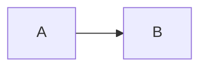

---
title: "Fidelity 😀"
tags: [one, two]
---

# ATX heading

Setext heading
--------------

Plain prose with **strong**, _emphasis_, ~~strike~~, `code`, é, and a [reference][ref].  

- parent
  - nested
- [x] task

| left | escaped \| pipe |
| :--- | ---: |
| one  | two             |

~~~python
print("long fence")
~~~

$$
x^2 + y^2
$$

Safe HTML
Body

export const Component = () => <Widget />

:::custom option
source island
:::

[ref]: https://example.com "title"
